# The Nightbear Rig

## Version 1.0

Taken into use approx. 2016-05-23.

### Components

* Dexcom G4
* Motorola Droid Mini
* Custom 3D printed case ([part 1](nightscout_rig_v1.0_dex.stl), [part 2](nightscout_rig_v1.0_droid.stl))
* [Nokia Wireless Charging Plate DT-601](https://www.microsoft.com/en/mobile/accessory/dt-601/)
* [Custom USB OTG cable](https://www.mimic-cables.com/products/nightscout-project-usb-cable) ([image](1.0/cable.png))
* [Metal hinges](https://www.k-rauta.fi/rautakauppa/ty%C3%B6kalut-ja-pienrauta/pienrauta/huonekalu--ja-v%C3%A4liovensaranat/kaapinsarana-prof-suora-25x19-fe-zn-2kpl) ([image](1.0/hinges.jpg))

### Images

### Lessons learned

* Magnets are held in place by uncovered epoxy, which sticks together when the lid is closed for long periods
* The Droid power button cover doesn't close the gap fully (mostly aesthetic though)
* The screws for the hinge (on the Droid side) need to be shortened to just a few millimeters so that they don't protrude out of the inner wall (requires special tools)
* The hinges and/or its installation holes are really hard to place exactly right without any guides
* Besides the Droid power button cover, there's nothing to prevent movement on the non-hinge side of the case
* The cable should have more room to move vertically when the rig is half-open, at least towards the inside, but possibly also towards the outside
* The space unused by the Dexcom could be reclaimed on the outside of the rig
* The Dexcom slot needs to be at least 1 mm taller (along the longest axis of the device)
* The Dexcom slot bridge (that holds the top end of the device in place) needs to be raised maybe 1 mm so that it actually fits in
* The Dexcom USB port cover slide knob isn't perfectly aligned
* The thumb-slot for unplugging the cables needs to be wider, so that the cables are easier to operate (possible other improvements to cable operation would also be welcome)
* The Droid status led is obscured by the bridge that holds in it place
* Similarly, it's impossible to do the swipe-from-top Android gesture because of the bridge
* The screws on the inside of the Dexcom side are ugly :)
* Rounding on the outside should be increased where possible

## Version 1.1

Taken into use approx. 2016-07-11.

### Components

Same as in v1.0.

### Images

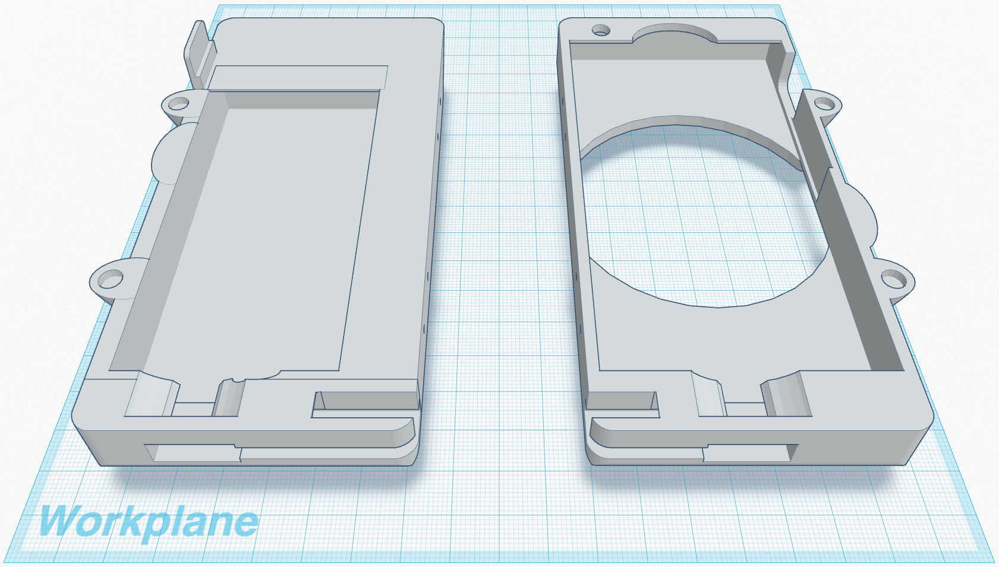

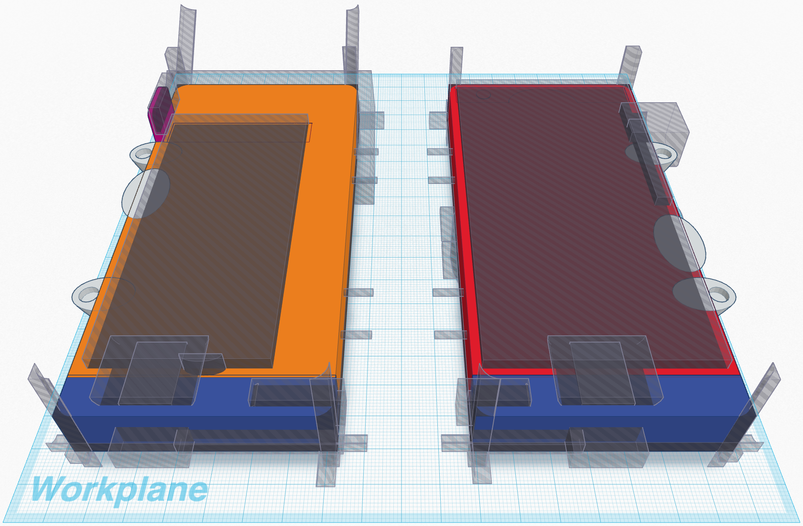

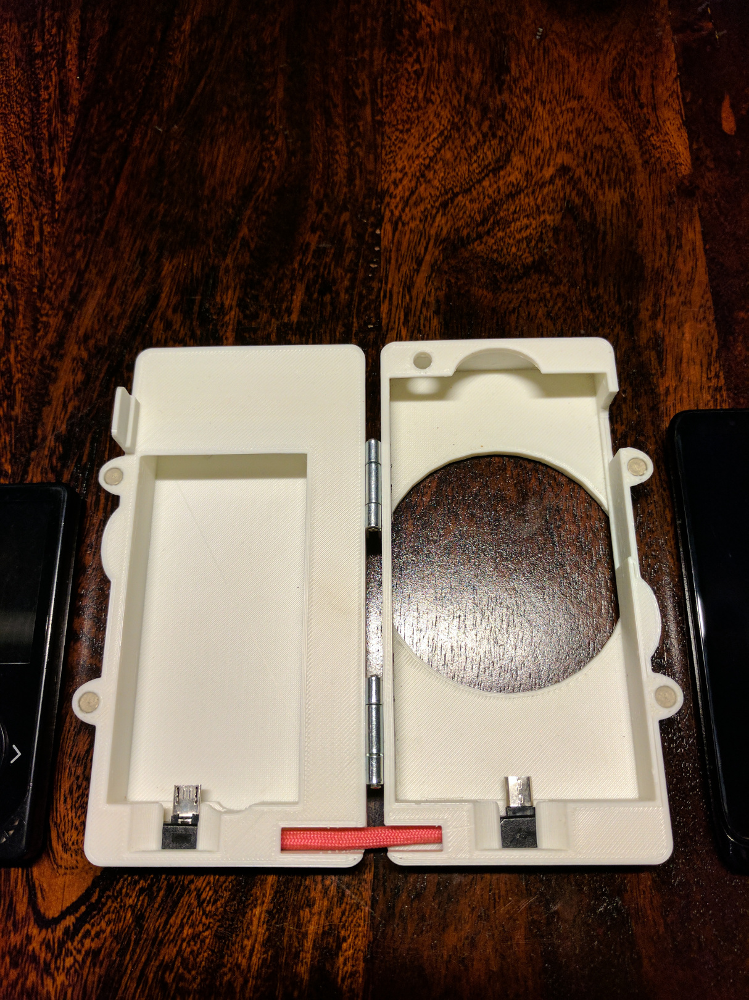

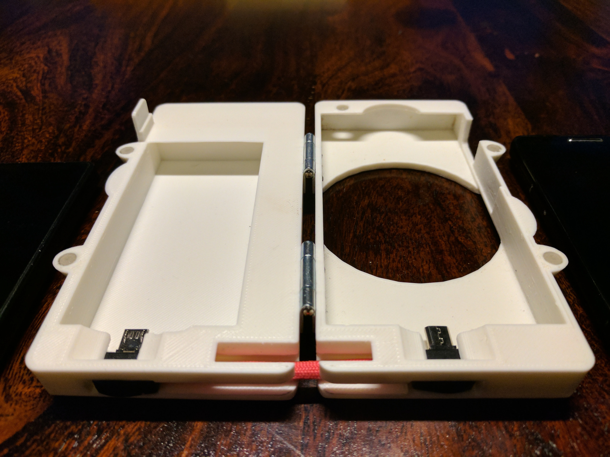

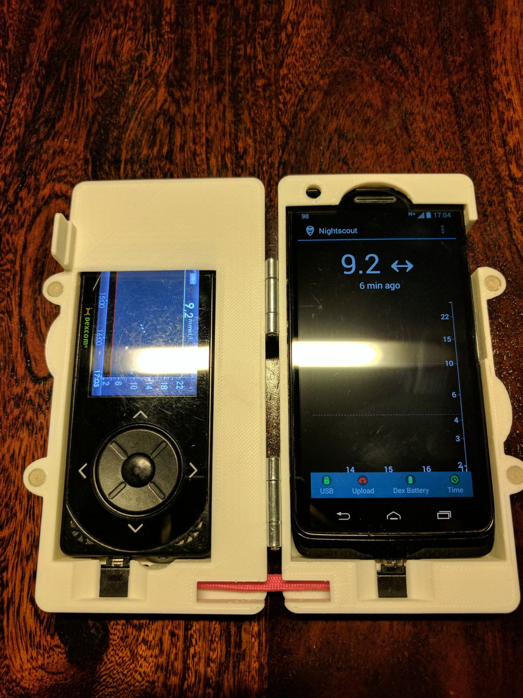

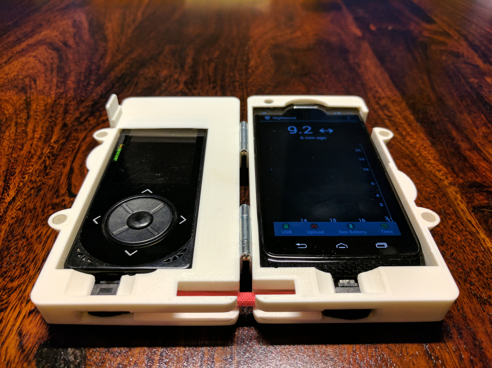

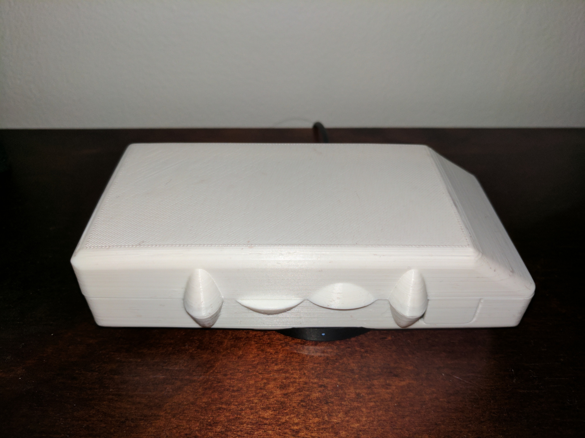

### Notable changes

* The epoxy covering the magnets can be treated with sand paper to make them not stick
* Droid power button cover closes fully
* Hinge installation holes are built into the model for easier installation
* The space unused by the Dexcom is reclaimed on the outside of the rig with a slant
* The thumb-slot for unplugging the cables is significantly wider
* The Droid status led is no longer obscured by the bridge that holds in it place
* There's a gap for doing the swipe-from-top Android gesture on the Droid
* Other minor tweaks

## Version 2.0

Taken into use approx. 2017-11-19.

### Components

* Dexcom G4
* Samsung I9505 Galaxy S4
* Mophie Powerstation 6200 mAh
* Custom 3D printed case & internal cable holder
* USB OTG y-cable & other USB cabling

### Notable changes

* Fully redesigned the case using parametrized models in OpenSCAD
* Case contains a power bank, which charges itself and the phone while plugged in, and the phone when not plugged in
* Remaining power can be viewed from the side of the case (see last pic)

### Images

[Click here for an interactive 3D version](2.0/rig-body.stl)

[Click here for an interactive 3D version](2.0/rig-lid.stl)

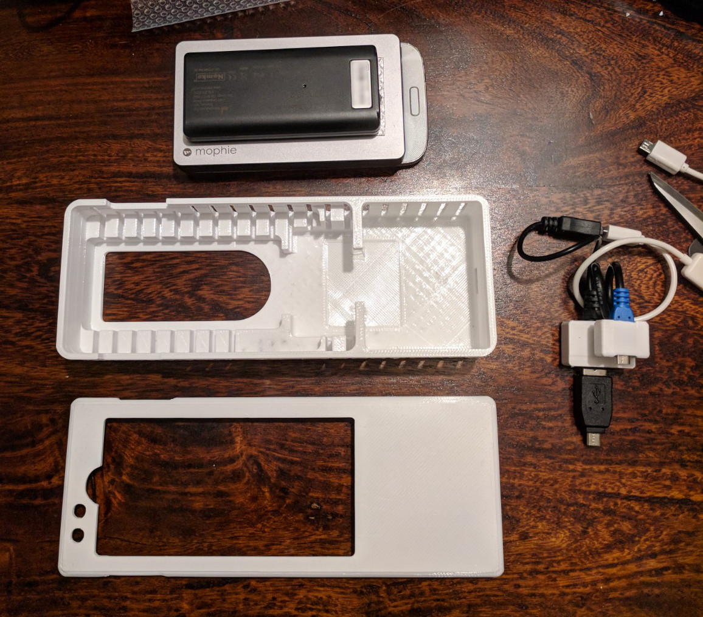

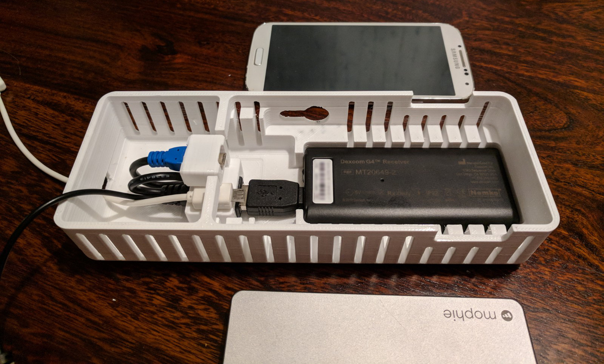

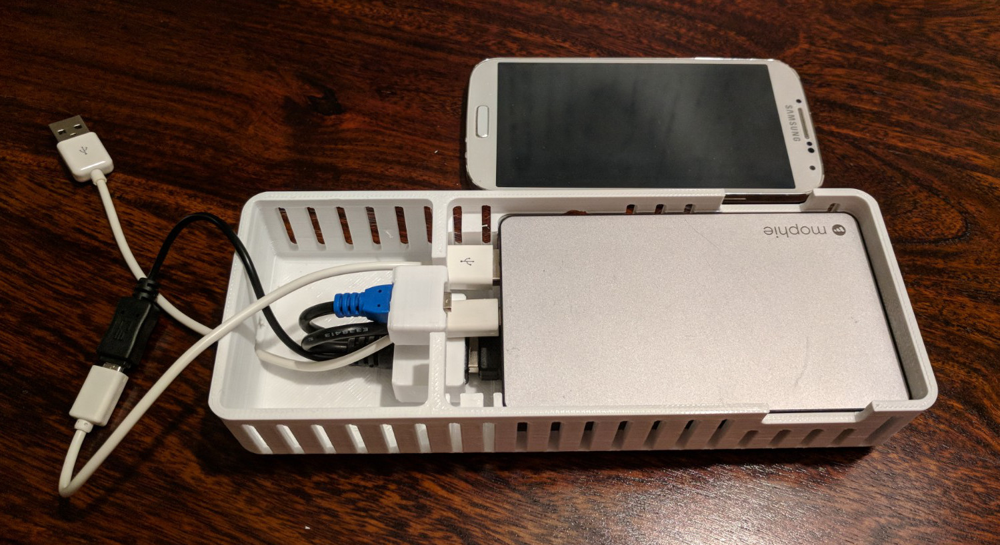

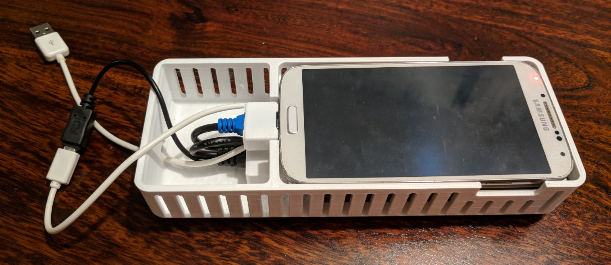

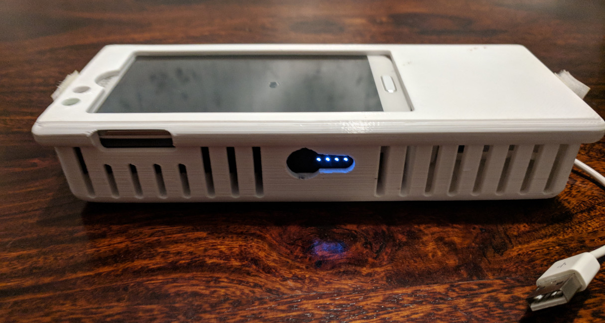
